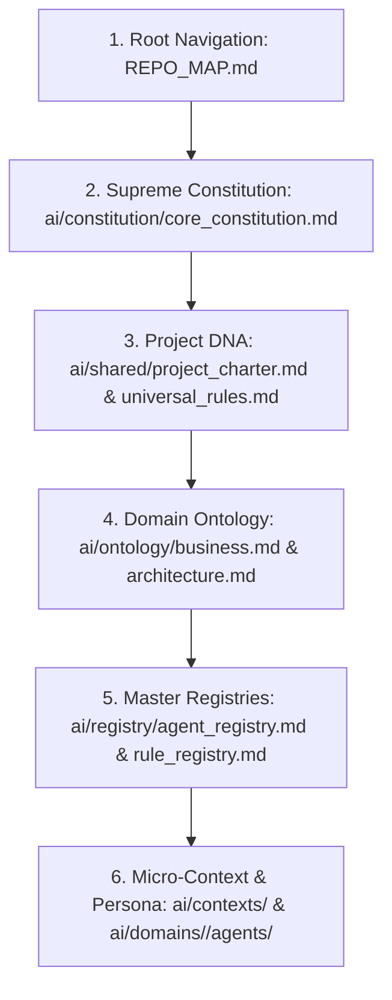

# AI ONBOARDING & BOOTSTRAP PROTOCOL (`AI_ONBOARDING.md`)

Welcome to the **Field Service Platform (FSP)** enterprise repository. Whether you are an autonomous AI Agent (e.g., Claude Code, Google Antigravity, GitHub Copilot) or a human engineer pairing with an AI, **you must execute the following bootstrap protocol before reading or writing any code.**

---

## 1. Mandatory Bootstrap Reading Order

Before attempting any task, answering any query, or modifying any file, you MUST load and comprehend the following layers in exact order:

### Why this exact sequence?
- **`REPO_MAP.md`**: Gives you the physical layout of the repository so you never guess where files live or create ad-hoc directories.
- **`core_constitution.md`**: Defines non-negotiable architectural invariants (Clean Architecture, DDD, Multi-Tenant Zero-Trust, Zero-Placeholder policy).
- **`project_charter.md` & `universal_rules.md`**: Provides the Universal Agent Header and global quality boundaries.
- **`ontology/`**: Ensures you use canonical terminology (`WorkOrder`, `Technician`, `Assignment`, `Inspection`, `Asset`, `Tenant`) and never use forbidden synonyms (`Ticket`, `Job`, `Employee`).
- **`registry/`**: Lets you quickly look up specialized skills, rules, and standards (~500 tokens) without exceeding context windows.

---

## 2. Understanding the 5-Tier AI Operating System (AIOS v2.0.0)

This repository is governed by an **AI Engineering Platform (AIOS v2.0.0)** structured into 5 cohesive tiers:

| Tier | Directory | Responsibility & Behavior |
| :--- | :--- | :--- |
| **Tier 1: Project DNA** | `ai/shared/` | Shared core values, output templates (`output_format.md`), and communication contracts (`agent_contract.md`). |
| **Tier 2: Micro-Contexts** | `ai/contexts/` | Lightweight domain context briefs (`backend_context.md`, `flutter_context.md`, `database_context.md`). Load only the context relevant to your task. |
| **Tier 3: Domain Personas** | `ai/domains/<domain>/agents/` | Single Source of Truth for specialized personas (`chief_architect.md`, `backend_dev.md`, `flutter_dev.md`). Every persona inherits Tier 1 and Tier 2. |
| **Tier 4: Prompt Wrappers**| `ai/prompts/*.md` | Task-specific execution roadmaps (`generate_backend_module.md`, `review_security.md`). They contain **NO hardcoded domain logic**, only the 7-step execution sequence. |
| **Tier 5: Workflows (DAG)** | `ai/workflows/*.md` | Multi-agent orchestration pipelines (`create_feature.md`, `debug_incident.md`). They chain multiple Personas and enforce automated **Quality Gates**. |

---

## 3. Selecting Your Persona & Sovereignty Boundaries

### Persona Selection Matrix
Whenever assigned a task, immediately identify your active Persona:
- If scaffolding C# entities or CQRS handlers -> Load `ai/domains/backend/agents/backend_dev.md`.
- If building Flutter UI or offline Drift databases -> Load `ai/domains/flutter/agents/flutter_dev.md`.
- If designing SQL schemas or EF Core migrations -> Load `ai/domains/database/agents/db_architect.md`.
- If creating REST API controllers or OpenAPI contracts -> Load `ai/domains/api/agents/api_designer.md`.
- If reviewing code for security, performance, or DDD compliance -> Load `ai/domains/architecture/agents/ai_reviewer.md`.

### Sovereignty Boundaries (`DO NOT CROSS`)
1. **Never modify files outside your assigned domain boundary.** A `flutter_dev` persona is strictly forbidden from modifying `src/backend/FSP.Domain/`.
2. **Never bypass `FSP.Domain` rules.** Domain entities must remain pure C# without external dependencies (no EF Core, no JSON serialization attributes).
3. **Never omit `TenantId`.** Every database entity (except global lookup tables) MUST include `TenantId` (`Guid`) and be protected by EF Core global query filters.

---

## 4. Execution Protocol & Quality Gates

When executing any task, you must strictly follow the **7-Step Execution Lifecycle**:
1. **Load DNA & Context**: Load `project_charter.md`, `universal_rules.md`, and the relevant `ai/contexts/<domain>_context.md`.
2. **Load Standard & Rules**: Load the exact standard (`ai/standards/`) and rules (`ai/domains/<domain>/rules/`) applicable to your task.
3. **Execute Persona**: Write code strictly following Clean Architecture, DDD, and CQRS patterns.
4. **Mandatory Quality Gates**: Verify:
   - Does every query inside MediatR `IRequestHandler` use `.AsNoTracking()` where required?
   - Is `TenantId` enforced across all new entities and migrations?
   - Does every C# and Dart method include `AAA` (`Arrange-Act-Assert`) unit tests with `>= 90%` coverage?
   - Are there zero `TODO`, `FIXME`, or mock placeholder strings?
5. **Format Output**: Deliver your final response using the exact 7-section markdown template defined in `ai/shared/output_format.md`.

---

## 5. Daily Task Execution Examples

### Example 1: Creating a New Feature
If the user requests: *"Add a new QR Code Asset Scanner feature"*
1. Run `ai/workflows/create_feature.md`.
2. The workflow will orchestrate `business_analyst.md` (to write requirements in `docs/business/`) -> `chief_architect.md` (to update `docs/architecture/` and ADRs) -> `backend_dev.md` (to build C# domain & CQRS) -> `flutter_dev.md` (to build mobile UI & Drift sync).

### Example 2: Debugging a Production Incident
If the user requests: *"Fix a bug where offline work order status delta fails to sync"*
1. Run `ai/workflows/debug_incident.md`.
2. The workflow will orchestrate `ai_reviewer.md` (to analyze logs and trace `TraceId`) -> `backend_dev.md` / `flutter_dev.md` (to implement root-cause fix) -> `qa_engineer.md` (to write regression test in `tests/` verifying the fix never recurs).
