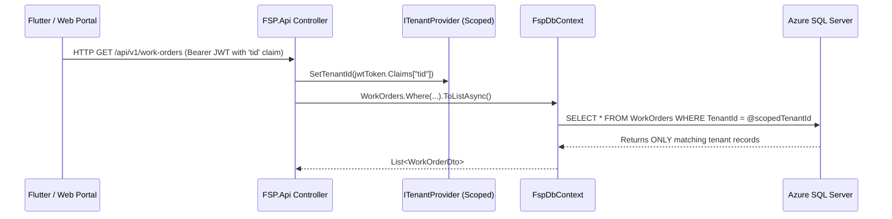

# CORE CAPABILITIES TECHNICAL BLUEPRINT (`core_capabilities.md`)

## 1. CAP-CORE-001: Multi-Tenant Data Isolation
### Architectural Pattern
Every enterprise tenant (`TenantId`) operates within a shared database instance with strict logical isolation.

---

## 2. CAP-CORE-002: Work Order State Machine Invariants
### State Transition Rules
The `WorkOrder` aggregate root enforces the following legal state transitions inside C# domain methods:
- `Draft` $\rightarrow$ `Assigned` (Via `AssignTechnician(technicianId)`)
- `Assigned` $\rightarrow$ `InProgress` (Via `StartService()`, triggers `WorkOrderStartedDomainEvent`)
- `InProgress` $\rightarrow$ `Completed` (Via `Complete()`, requires `Inspections.All(i => i.IsCompleted == true)`)
- `Assigned` / `InProgress` $\rightarrow$ `Cancelled` (Via `Cancel(reason)`)

---

## 3. CAP-CORE-005: Offline Delta Sync Engine
### Last-Write-Wins Vector & Client Queue
1. All local mutations (`WorkOrder` checklist checks, notes, photos) are written directly to the local `Drift` SQLite `SyncQueueTable` with a local `ClientTimestampUtc` and GUID `MutationId`.
2. A background worker (`WorkManager`) pushes pending items to `/api/v1/sync/push` when network connectivity is detected.
3. Server compares `ClientTimestampUtc` against server `LastModifiedUtc`. If valid, server commits transaction and returns acknowledgment GUIDs to prune the local SQLite queue.
