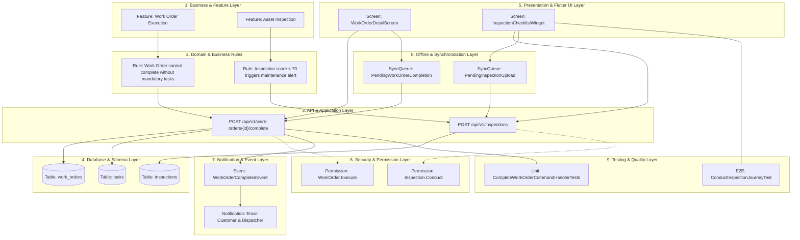

# FSP Master Knowledge Graph & Impact Traceability Matrix

## 1. Overview
This file serves as the centralized relational map connecting high-level business features down to low-level database tables, UI screens, security permissions, offline sync queues, and automated test cases.

When any layer of the application changes, AI agents and engineers MUST consult this graph to execute a full **Impact Analysis** and ensure zero regressions across downstream components.

---

## 2. Full Relational Chain Diagram (Mermaid)

---

## 3. Impact Analysis Traceability Matrix

| Feature / Domain Entity | Primary API Endpoint | Database Table | Flutter UI Screen | Permission Required | Downstream Event / Sync | Target Test Suite |
| :--- | :--- | :--- | :--- | :--- | :--- | :--- |
| **Work Order Completion** | `POST /api/v1/work-orders/{id}/complete` | `work_orders`, `tasks` | `WorkOrderDetailScreen` | `WorkOrder.Execute` | `WorkOrderCompletedEvent`, `PendingWorkOrderCompletion` | `CompleteWorkOrderCommandHandlerTests` |
| **Asset Inspection** | `POST /api/v1/inspections` | `inspections`, `inspection_items` | `InspectionChecklistScreen` | `Inspection.Conduct` | `InspectionSubmittedEvent`, `PendingInspectionUpload` | `ConductInspectionJourneyTest` |
| **Technician Assignment** | `POST /api/v1/assignments` | `assignments`, `technicians` | `DispatchBoardWidget` | `Dispatch.Manage` | `TechnicianAssignedEvent` | `AssignTechnicianCommandHandlerTests` |
