# MULTI-AGENT WORKFLOW: END-TO-END FEATURE CREATION

This workflow coordinates the complete, enterprise-grade development lifecycle of a new feature within the Field Service Platform (`FSP`), ensuring strict alignment with Clean Architecture, CQRS, and Offline-First principles from conception to verification.

---

## Workflow DAG Execution Chain

```mermaid
graph TD
    A[Step 1: Business Analyst<br/>generate_prd.md / generate_fsd.md] --> B{Gate 1: Ontology & Scope Check}
    B -- Pass --> C[Step 2: Chief Architect<br/>review_architecture_adr.md]
    B -- Fail --> A
    C --> D{Gate 2: Architecture Boundary Check}
    D -- Pass --> E[Step 3: API Designer<br/>design_rest_api.md]
    D -- Fail --> C
    E --> F[Step 4: Database Architect<br/>review_database_schema.md]
    F --> G[Step 5: Principal .NET Backend Dev<br/>generate_backend_module.md]
    G --> H{Gate 3: Layer & TenantId Isolation Check}
    H -- Pass --> I[Step 6: Principal Flutter Dev<br/>generate_flutter_feature.md]
    H -- Fail --> G
    I --> J{Gate 4: Offline Sync & UI Ergonomics Check}
    J -- Pass --> K[Step 7: QA Automation Lead<br/>generate_test_plan.md]
    J -- Fail --> I
    K --> L[Step 8: AI Review Lead<br/>review_security.md & review_performance.md]
    L --> M{Gate 5: Zero-Trust Security & Build Audit}
    M -- Pass --> N([Feature Ready for Merge])
    M -- Fail --> L
```

---

## Detailed Step & Gate Instructions

### Step 1: Requirements Formulation (`Business Analyst`)
- **Action:** Execute Prompt Wrappers `ai/prompts/generate_prd.md` and `ai/prompts/generate_fsd.md`.
- **Output:** `docs/business/prd.md` and `docs/business/fsd.md` updated with the feature specifications.
- **Gate 1 (Ontology & Scope Audit):**
  - Verify every entity name maps cleanly to `ai/ontology/business.md`.
  - Verify KPIs and SLAs are quantitatively defined.
  - *If Gate 1 Fails:* Return feedback to Step 1 and regenerate.

### Step 2: Architectural & Graph Verification (`Chief Architect`)
- **Action:** Execute Prompt Wrapper `ai/prompts/review_architecture_adr.md`.
- **Output:** Graph impact assessment and formal `ADR` (if cross-service communication or new patterns are introduced).
- **Gate 2 (Architecture Boundary Audit):**
  - Verify Clean Architecture dependency graph (`Application -> Domain <- Infrastructure`).
  - *If Gate 2 Fails:* Reject design and instruct Architect to resolve coupling.

### Step 3: API Contract Specification (`API Designer`)
- **Action:** Execute Prompt Wrapper `ai/prompts/design_rest_api.md`.
- **Output:** OpenAPI 3.0 specification DTOs and RFC 7807 problem payloads.

### Step 4: Database Schema & Migration Planning (`Database Architect`)
- **Action:** Execute Prompt Wrapper `ai/prompts/review_database_schema.md`.
- **Output:** Table definitions, index optimization, and EF Core Entity Configuration (`IEntityTypeConfiguration<T>`).

### Step 5: .NET Core Backend Scaffolding (`Principal .NET Backend Dev`)
- **Action:** Execute Prompt Wrapper `ai/prompts/generate_backend_module.md`.
- **Output:** Domain Entity, MediatR CQRS Handlers, `FluentValidation` rules, and Repository implementation in `src/backend/`.
- **Gate 3 (Layer & Tenant Isolation Audit):**
  - Verify `TenantId` is enforced on all DbContext queries (`AsNoTracking()` applied on queries).
  - *If Gate 3 Fails:* Reject code changes and re-run Step 5.

### Step 6: Flutter Mobile Implementation (`Principal Flutter Dev`)
- **Action:** Execute Prompt Wrapper `ai/prompts/generate_flutter_feature.md`.
- **Output:** `Freezed` domain models, Drift local database table, `Dio` API client, Riverpod state providers, and offline-responsive UI widgets in `src/flutter/`.
- **Gate 4 (Offline & Ergonomics Audit):**
  - Verify local persistence table exists for offline sync and touch targets meet `>= 48x48px`.
  - *If Gate 4 Fails:* Re-run Step 6 with explicit ergonomics instructions.

### Step 7: Test Plan & Automated Suite Generation (`QA Automation Lead`)
- **Action:** Execute Prompt Wrapper `ai/prompts/generate_test_plan.md`.
- **Output:** `AAA` unit/integration test suites verifying happy path, boundary conditions, and tenant isolation in `.NET` (`xUnit`/`Testcontainers`) and `Flutter` (`flutter_test`).

### Step 8: Final Automated Review & Security Audit (`AI Code Reviewer Lead`)
- **Action:** Execute Prompt Wrappers `ai/prompts/review_security.md` and `ai/prompts/review_performance.md`.
- **Output:** Comprehensive code review report (`docs/testing/code_review_report.md`).
- **Gate 5 (Zero-Trust Final Audit):**
  - Verify zero `TODO`/placeholder comments remain.
  - Verify all output follows `ai/shared/output_format.md` 7-section layout.
  - *If Gate 5 Passes:* Mark feature ready for PR review and merge.
