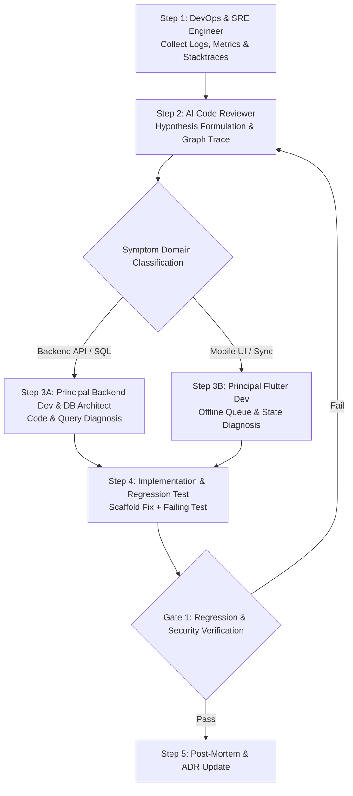

# MULTI-AGENT WORKFLOW: ROOT-CAUSE INCIDENT DEBUGGING & TRIAGE

This workflow coordinates diagnostic triage across SRE, Backend, Database, Mobile, and QA Personas to swiftly isolate root causes, prevent symptom-only hotfixes, and emit regression tests.

---

## Workflow DAG Execution Chain

---

## Detailed Step & Gate Instructions

### Step 1: Telemetry & Stacktrace Extraction (`DevOps & SRE Engineer`)
- **Action:** Activate `ai/domains/devops/agents/sre.md`. Collect production logs, Application Insights telemetry, database deadlocks, or mobile crash reports (`Firebase Crashlytics`).
- **Output:** Incident Artifact (`docs/testing/incident_report.md`) detailing the exact exception message, stacktrace, timestamp, `TenantId`, and user actions.

### Step 2: Hypothesis Formulation & Dependency Trace (`AI Code Reviewer`)
- **Action:** Activate `ai/domains/architecture/agents/ai_reviewer.md`. Cross-reference the stacktrace with `ai/knowledge_graph/master_graph.md` to map upstream/downstream impacts.
- **Output:** Top 3 prioritized root-cause hypotheses with exact file path and line number predictions (`[ClassName](file:///path/to/file#L10-L20)`).

### Step 3: Domain Diagnosis & Fix Scaffolding
- **Step 3A (Backend/Database Bugs):** Activate `ai/domains/backend/agents/backend_dev.md` and `ai/domains/database/agents/db_architect.md`. Inspect MediatR handler concurrency, EF Core tracking behavior, or missing SQL indexes.
- **Step 3B (Mobile/Offline Sync Bugs):** Activate `ai/domains/flutter/agents/flutter_dev.md`. Inspect Riverpod state invalidation, Drift SQLite conflict policies, or network retry backoff loops.

### Step 4: Regression Test & Fix Implementation (`QA Lead + Domain Dev`)
- **Action:** Activate `ai/domains/testing/agents/qa_engineer.md` alongside the Domain Developer.
  1. Write a **failing unit/integration test** that reproduces the exact bug before modifying production code (`RED`).
  2. Implement the minimal clean code fix (`GREEN`).
  3. Verify the test turns green without breaking existing suites.

### Step 5: Verification Gate & Post-Mortem (`Chief Architect`)
- **Gate 1 (Regression & Security Audit):**
  - Verify fix does not introduce N+1 query loops or violate multi-tenant isolation.
  - Verify failing test now passes consistently.
- **Post-Mortem & Lesson Log:** Update `ai/memory/lessons/` with the root cause pattern so all agents learn from the incident.
