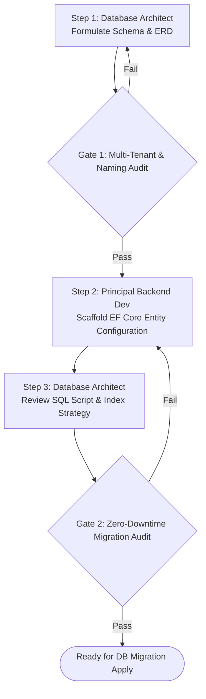

# MULTI-AGENT WORKFLOW: DATABASE SCHEMA & MIGRATION DESIGN

This workflow coordinates Database Architect and Principal .NET Backend Developer to design, optimize, and verify database tables, indexes, and EF Core entity configurations (`IEntityTypeConfiguration<T>`).

---

## Workflow DAG Execution Chain

---

## Detailed Step & Gate Instructions

### Step 1: Schema Formulation (`Database Architect`)
- **Action:** Activate `ai/domains/database/agents/db_architect.md`. Design table structure and update `docs/database/erd.md`.
- **Gate 1 (Multi-Tenant & Naming Check):**
  - Verify every table includes `TenantId` (`uniqueidentifier`) and audit columns (`CreatedAtUtc`, `CreatedBy`).
  - Verify table names use `PascalCase` pluralization (`WorkOrders`, `Technicians`).
  - *If Gate 1 Fails:* Return to Step 1.

### Step 2: EF Core Configuration (`Principal .NET Backend Dev`)
- **Action:** Activate `ai/domains/backend/agents/backend_dev.md`. Implement `IEntityTypeConfiguration<TEntity>` with explicit column precisions and global query filters (`HasQueryFilter(e => e.TenantId == _tenantProvider.TenantId)`).

### Step 3: Migration Audit & Index Check (`Database Architect`)
- **Action:** Activate `ai_prompts/review_database_schema.md`.
- **Gate 2 (Zero-Downtime Migration Audit):**
  - Verify migration script does not drop populated columns directly or lock tables without online index build flags (`WITH (ONLINE = ON)`).
