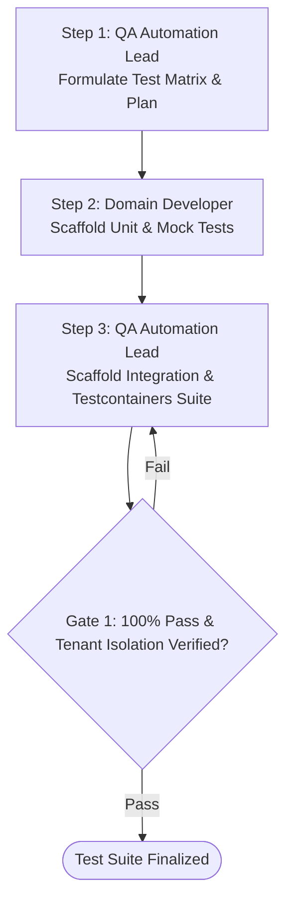

# MULTI-AGENT WORKFLOW: COMPREHENSIVE TEST SUITE GENERATION

This workflow coordinates `QA Automation Lead` and Domain Developers to produce complete test coverage (`AAA` pattern, containerized integration tests, and edge case matrices).

---

## Workflow DAG Execution Chain

---

## Detailed Step & Gate Instructions

### Step 1: Test Plan & Matrix (`QA Automation Lead`)
- **Action:** Activate `generate_test_plan.md` to create happy path, boundary, and negative scenarios.

### Step 2: Unit Suite Scaffolding (`Domain Developer`)
- **Action:** Scaffold `AAA` unit tests (`xUnit` + `NSubstitute` for .NET; `mocktail` for Dart).

### Step 3: Integration & Multi-Tenant Suite (`QA Automation Lead`)
- **Action:** Scaffold containerized integration tests verifying database queries with explicit `TenantId` filters.
- **Gate 1 (Coverage & Isolation Check):** All suites must run cleanly and verify multi-tenant isolation.
