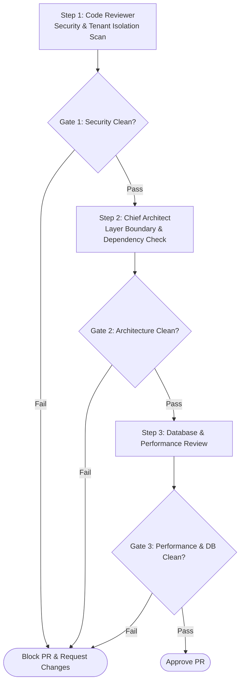

# MULTI-AGENT WORKFLOW: AUTOMATED PR REVIEW & SECURITY AUDIT

This workflow executes automated gating checks on any pull request submitted to the `main` or `develop` branch.

---

## Workflow DAG Execution Chain

---

## Detailed Step & Gate Instructions

### Step 1: Security & Tenant Scan (`AI Code Reviewer`)
- **Action:** Execute `review_security.md`.
- **Gate 1:** Zero tolerance for hardcoded credentials, raw SQL strings without parameters, or missing `TenantId` filters.

### Step 2: Architecture Audit (`Chief Architect`)
- **Action:** Execute `review_architecture_adr.md`.
- **Gate 2:** Verify Domain layer purity and MediatR handler structure.

### Step 3: Performance & Database Audit (`Database Architect`)
- **Action:** Execute `review_performance.md` and `review_database_schema.md`.
- **Gate 3:** Verify `.AsNoTracking()` on read queries and index coverage.
