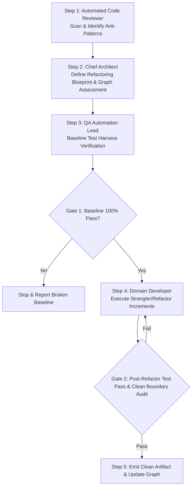

# MULTI-AGENT WORKFLOW: CLEAN ARCHITECTURE REFACTORING

This workflow coordinates Chief Architect, Code Reviewer, Backend, Flutter, and QA Personas to systematically restructure legacy or degraded modules back into pristine Clean Architecture adherence without breaking functional behavior.

---

## Workflow DAG Execution Chain

---

## Detailed Step & Gate Instructions

### Step 1: Codebase Audit & Debt Identification (`AI Code Review Lead`)
- **Action:** Activate `ai/domains/architecture/agents/ai_reviewer.md`. Scan target files or modules against `ai/standards/ddd_standard.md`, `naming_standard.md`, and domain rules.
- **Output:** Debt Inventory table listing layer boundary violations, fat controllers, raw SQL queries without `TenantId`, or tightly coupled UI widgets.

### Step 2: Refactoring Blueprint & Impact Assessment (`Chief Architect`)
- **Action:** Activate `ai/domains/architecture/agents/chief_architect.md`. Consult `ai/knowledge_graph/master_graph.md` to evaluate impact.
- **Output:** Refactoring Blueprint (`docs/architecture/refactoring_plan.md`) outlining step-by-step decoupling increments using Strangler Fig or CQRS segregation patterns.

### Step 3: Baseline Test Harness Check (`QA Automation Lead`)
- **Action:** Activate `ai/domains/testing/agents/qa_engineer.md`. Run all existing unit and integration tests for the target module.
- **Gate 1 (Baseline Integrity Check):**
  - Must achieve 100% test pass on existing suites before refactoring begins.
  - *If Gate 1 Fails:* Stop workflow and require bug fix before refactoring (`debug_incident.md`).

### Step 4: Incremental Transformation (`Principal Backend / Flutter Dev`)
- **Action:** Activate `backend_dev.md` or `flutter_dev.md`. Execute the refactoring increments:
  1. Extract interfaces and pure domain entities.
  2. Migrate business logic from Controller/Widget into MediatR Handlers or Riverpod Notifiers.
  3. Apply `FluentValidation` and `Result<T>` pattern.

### Step 5: Verification Gate & Graph Update (`Code Reviewer + Chief Architect`)
- **Gate 2 (Zero-Regression & Layer Audit):**
  - Re-run all QA test suites (Must pass 100%).
  - Verify layer boundaries using static check rules (`RULE-DDD-001`).
- **Output:** Update `ai/knowledge_graph/master_graph.md` and record structural improvements.
