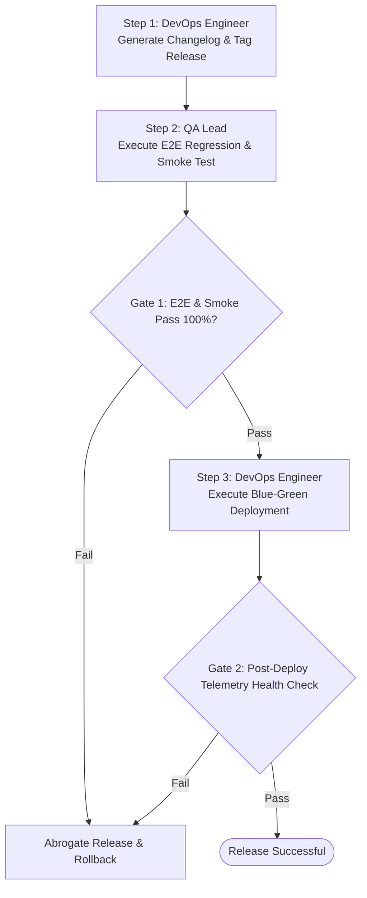

# MULTI-AGENT WORKFLOW: RELEASE VERSION & DEPLOYMENT

This workflow coordinates DevOps/SRE, QA Lead, and Product Manager to safely build, tag, verify, and deploy new versions of `FSP`.

---

## Workflow DAG Execution Chain

---

## Detailed Step & Gate Instructions

### Step 1: Release Tagging & Changelog (`DevOps Engineer`)
- **Action:** Activate `devops_engineer.md`. Compile git history into `docs/api/changelog.md` and bump Semantic Versioning (`vX.Y.Z`).

### Step 2: E2E Verification (`QA Automation Lead`)
- **Action:** Activate `qa_engineer.md`. Run automated Playwright/Appium suites against staging.
- **Gate 1:** 100% passing rate across all critical user journeys.

### Step 3: Production Deployment & Telemetry Verification (`SRE`)
- **Action:** Execute Blue-Green or Canary deployment via GitHub Actions (`docs/devops/github_actions.md`).
- **Gate 2:** Monitor Application Insights for 15 minutes; zero 5xx spike or memory leak allowed.
