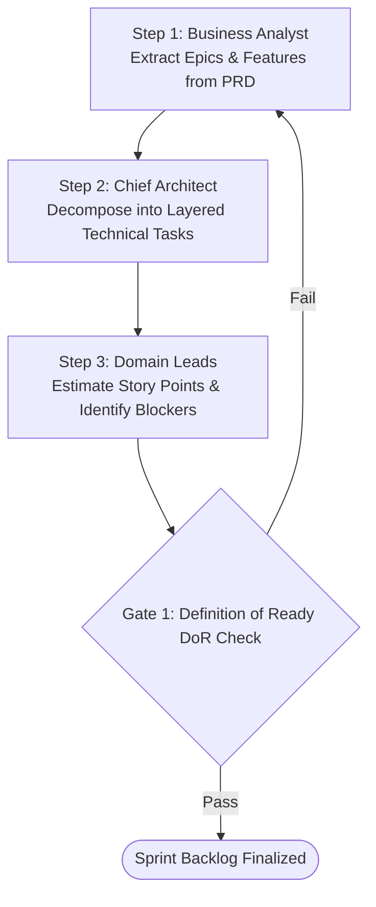

# MULTI-AGENT WORKFLOW: SPRINT PLANNING & TASK BREAKDOWN

This workflow decomposes high-level PRDs (`docs/business/prd.md`) and FSDs into atomic, assignable engineering tasks with clear effort estimates and acceptance criteria (`docs/business/acceptance_criteria.md`).

---

## Workflow DAG Execution Chain

---

## Detailed Step & Gate Instructions

### Step 1: Feature Extraction (`Business Analyst`)
- **Action:** Review `docs/business/prd.md` and define clear user stories (`As a <persona>, I want <goal>, so that <benefit>`).

### Step 2: Technical Task Decomposition (`Chief Architect`)
- **Action:** Break each feature into exact architectural layers:
  - `[Domain]` Scaffold Entity & Events (`backend_dev.md`)
  - `[Application]` Scaffold MediatR Handlers (`backend_dev.md`)
  - `[Infrastructure]` Scaffold EF Core Config (`db_architect.md`)
  - `[API]` Scaffold Controller & Swagger Spec (`api_designer.md`)
  - `[Flutter]` Scaffold Screen & Riverpod Provider (`flutter_dev.md`)
  - `[QA]` Scaffold Integration Suite (`qa_engineer.md`)

### Step 3: DoR Gate (`QA Lead + Architect`)
- **Gate 1 (Definition of Ready Check):** Every task must have explicit acceptance criteria, zero ambiguous terms, and known upstream dependencies before entering the sprint.
