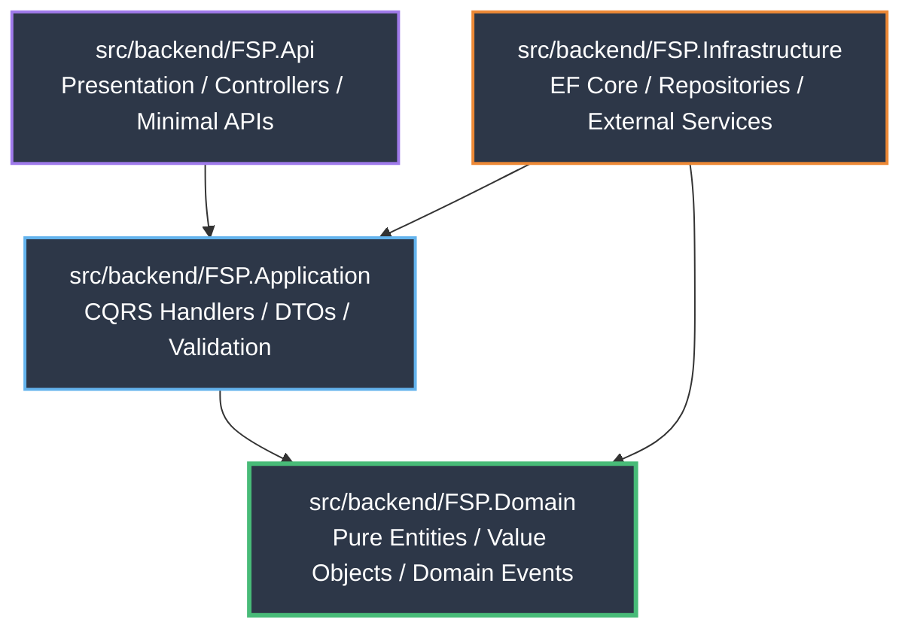

# CLEAN ARCHITECTURE IMPLEMENTATION SPECIFICATIONS

## 1. Architectural Principles & Layer Boundaries
Field Service Platform (`FSP`) rigorously follows Robert C. Martin's **Clean Architecture** to ensure the enterprise domain model (`FSP.Domain`) is entirely independent of user interfaces, frameworks, databases, and third-party external agencies.

---

## 2. Layer Dependency Graph

---

## 3. Strict Rules per Layer

### 3.1 `FSP.Domain` (Core / Inner Circle)
- **Zero Dependencies:** No NuGet dependencies allowed other than standard C# primitives (`System`).
- **Encapsulation:** All setters on domain entity properties MUST be `private` or `protected`. Mutations must occur via explicit domain methods (`workOrder.AssignTechnician(technicianId)`).
- **Domain Events:** Entities raise domain events (`BaseEntity.AddDomainEvent(...)`) when critical state transitions occur.

### 3.2 `FSP.Application` (Orchestration Layer)
- **MediatR Handlers:** Contains `IRequestHandler<TCommand, Result<T>>` and `IRequestHandler<TQuery, Result<T>>`.
- **Validation:** Contains `FluentValidation` `AbstractValidator<T>` executing before any handler runs via MediatR Pipeline Behaviors.
- **Interfaces Only:** Defines `IRepository<T>`, `IEmailService`, and `ITenantProvider`. Never references EF Core or SQL directly.

### 3.3 `FSP.Infrastructure` (Persistence & External Gateway Layer)
- **EF Core Implementation:** Implements `ApplicationDbContext` and `Repository<T> : IRepository<T>`.
- **Multi-Tenant Global Query Filters:** In `OnModelCreating`, explicitly applies `builder.Entity<T>().HasQueryFilter(e => e.TenantId == _tenantProvider.TenantId)`.
- **AsNoTracking on Reads:** Read-only repositories MUST apply `.AsNoTracking()` to avoid Entity Framework change tracker memory overhead.

### 3.4 `FSP.Api` (Presentation & Entry Point Layer)
- **Zero Business Logic:** Controllers and endpoints ONLY parse HTTP requests, dispatch commands/queries via `IMediator.Send(...)`, and map `Result<T>` to HTTP status codes (`200 OK`, `201 Created`, or RFC 7807 `ProblemDetails`).
