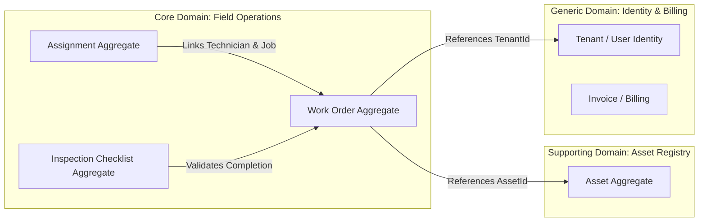

# DOMAIN-DRIVEN DESIGN (DDD) SPECIFICATIONS

## 1. Ubiquitous Language & Strategic Modeling
Every term used across C# classes, database columns, and Flutter widgets MUST correspond directly to the canonical definitions established in `ai/ontology/business.md`.

---

## 2. Bounded Context Map

---

## 3. Aggregate Roots & Transaction Boundaries
1. **`WorkOrder` Aggregate Root:** Controls the lifecycle of `WorkOrder`, its status transitions, and associated `Inspection` validation.
2. **`Tenant` Aggregate Root:** Controls organization limits, subscription SLAs, and user memberships.
3. **`Asset` Aggregate Root:** Controls physical equipment history, maintenance intervals, and telemetry logs.

### Transaction Invariant
A single MediatR command handler MUST only mutate **one Aggregate Root per database transaction**. If changing a `WorkOrder` status must trigger billing creation, it MUST be decoupled via a published `WorkOrderCompletedDomainEvent` consumed asynchronously.
