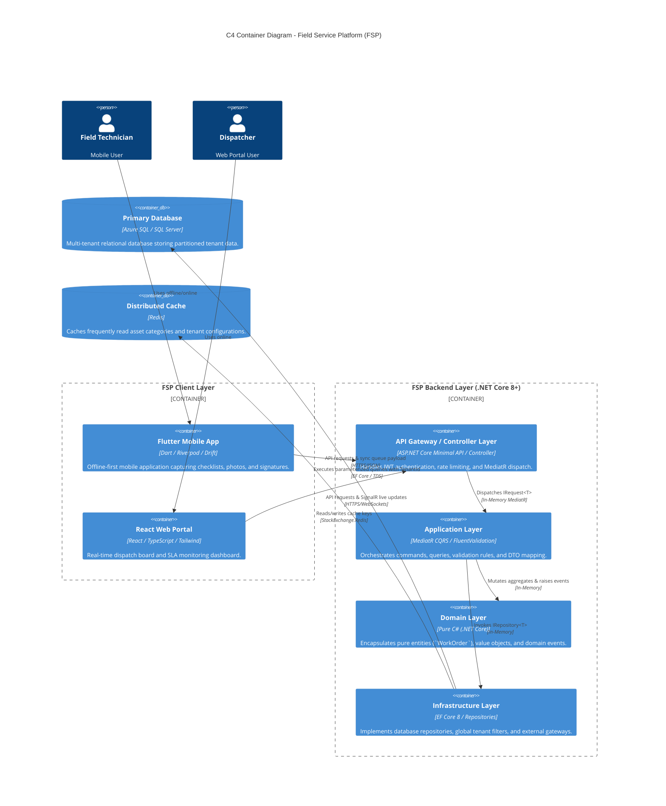

# C4 CONTAINER & COMPONENT DIAGRAMS

## 1. C4 Container Diagram (Level 2)

```mermaid
C4Container
    title C4 Container Diagram - Field Service Platform (FSP)
    
    Person(tech, "Field Technician", "Mobile User")
    Person(disp, "Dispatcher", "Web Portal User")
    
    Container_Boundary(c1, "FSP Client Layer") {
        Container(mobile, "Flutter Mobile App", "Dart / Riverpod / Drift", "Offline-first mobile application capturing checklists, photos, and signatures.")
        Container(web, "React Web Portal", "React / TypeScript / Tailwind", "Real-time dispatch board and SLA monitoring dashboard.")
    }
    
    Container_Boundary(c2, "FSP Backend Layer (.NET Core 8+)") {
        Container(api, "API Gateway / Controller Layer", "ASP.NET Core Minimal API / Controller", "Handles JWT authentication, rate limiting, and MediatR dispatch.")
        Container(app, "Application Layer", "MediatR CQRS / FluentValidation", "Orchestrates commands, queries, validation rules, and DTO mapping.")
        Container(dom, "Domain Layer", "Pure C# (.NET Core)", "Encapsulates pure entities (`WorkOrder`), value objects, and domain events.")
        Container(infra, "Infrastructure Layer", "EF Core 8 / Repositories", "Implements database repositories, global tenant filters, and external gateways.")
    }
    
    ContainerDb(sql, "Primary Database", "Azure SQL / SQL Server", "Multi-tenant relational database storing partitioned tenant data.")
    ContainerDb(redis, "Distributed Cache", "Redis", "Caches frequently read asset categories and tenant configurations.")
    
    Rel(tech, mobile, "Uses offline/online")
    Rel(disp, web, "Uses online")
    Rel(mobile, api, "API requests & sync queue payload", "HTTPS/JSON")
    Rel(web, api, "API requests & SignalR live updates", "HTTPS/WebSockets")
    Rel(api, app, "Dispatches IRequest<T>", "In-Memory MediatR")
    Rel(app, dom, "Mutates aggregates & raises events", "In-Memory")
    Rel(app, infra, "Invokes IRepository<T>", "In-Memory")
    Rel(infra, sql, "Executes parameterized queries with TenantId", "EF Core / TDS")
    Rel(infra, redis, "Reads/writes cache keys", "StackExchange.Redis")
```
