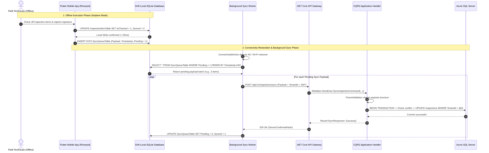

# SEQUENCE DIAGRAMS

## 1. Mobile Offline Checklist Sync & Conflict Handling Sequence

```mermaid
sequenceDiagram
    autonumber
    actor Tech as Field Technician (Offline)
    participant App as Flutter Mobile App (Riverpod)
    participant SQLite as Drift Local SQLite Database
    participant Sync as Background Sync Worker
    participant API as .NET Core API Gateway
    participant MediatR as CQRS Application Handler
    participant SQL as Azure SQL Server
    
    Note over Tech, SQLite: 1. Offline Execution Phase (Airplane Mode)
    Tech->>App: Check off inspection items & capture signature
    App->>SQLite: UPDATE InspectionItemTable SET IsChecked = 1, Synced = 0
    SQLite-->>App: Local Write confirmed (< 20ms)
    App->>SQLite: INSERT INTO SyncQueueTable (Payload, Timestamp, Pending = 1)
    
    Note over App, SQL: 2. Connectivity Restoration & Background Sync Phase
    Sync->>Sync: ConnectivityMonitor detects 4G / Wi-Fi restored
    Sync->>SQLite: SELECT * FROM SyncQueueTable WHERE Pending = 1 ORDER BY Timestamp ASC
    SQLite-->>Sync: Return pending payload batch (e.g., 3 items)
    
    loop For each Pending Sync Payload
        Sync->>API: POST /api/v1/inspections/sync (Payload + TenantId + JWT)
        API->>MediatR: IMediator.Send(new SyncInspectionCommand(...))
        MediatR->>MediatR: FluentValidation checks payload structure
        MediatR->>SQL: BEGIN TRANSACTION -> Check conflict -> UPDATE Inspections WHERE TenantId = @id
        SQL-->>MediatR: Commit successful
        MediatR-->>API: Result<SyncResponse>.Success()
        API-->>Sync: 200 OK (ServerConfirmedHash)
        Sync->>SQLite: UPDATE SyncQueueTable SET Pending = 0, Synced = 1
    end
```
