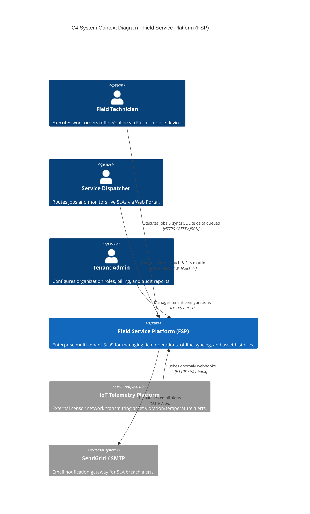

# ENTERPRISE ARCHITECTURE OVERVIEW

## 1. C4 System Context Diagram (Level 1)

---

## 2. Multi-Tenant Enterprise Isolation Strategy
FSP uses a **Pool Tenant Strategy (Shared Database, Shared Schema, TenantId Partitioning)** to achieve high scalability and cost efficiency while enforcing rigorous data security:
- Every table includes `TenantId` (`uniqueidentifier`, indexed).
- EF Core `ApplicationDbContext` automatically intercepts every LINQ query and injects `WHERE TenantId = @tenantId`.
- JWT Bearer tokens contain a mandatory `tid` claim validated on every API request.
