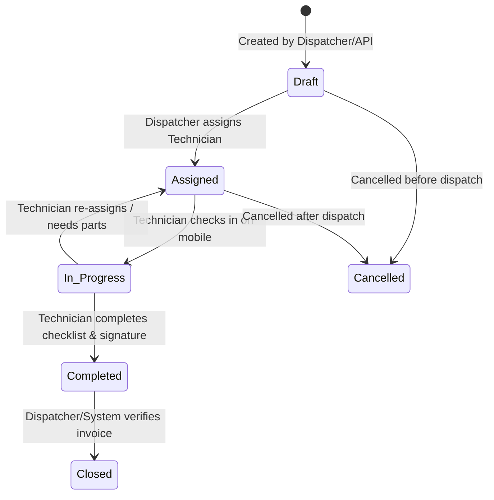

# FUNCTIONAL SPECIFICATION DOCUMENT (FSD)

## 1. Work Order State Machine & Invariants

### State Invariants (`WorkOrderStatus`)
1. **`Assigned`:** A `WorkOrder` cannot transition to `Assigned` unless exactly one active `Technician` is linked via `Assignment`.
2. **`Completed`:** A `WorkOrder` cannot transition to `Completed` unless all mandatory items in its linked `Inspection` checklist have `IsChecked = true` and a customer `DigitalSignatureUrl` is present.
3. **`Closed`:** Once `Closed`, a `WorkOrder` is immutable. No further modifications are permitted (`IsReadOnly = true`).

---

## 2. Offline Synchronization Engine (`Delta Sync Protocol`)

### 2.1 Local Storage Schema (`Drift` SQLite)
Every mobile device maintains a local SQLite database containing tables mirror-mapped to the backend entities (`WorkOrderTable`, `AssignmentTable`, `InspectionItemTable`, `SyncQueueTable`).

### 2.2 Conflict Resolution Matrix
When network connectivity is restored after offline operations:
- **Last-Write-Wins (Timestamp based):** For non-critical text fields (`Notes`, `Description`).
- **Server-Wins:** For administrative status overrides (`Cancelled` by dispatcher while technician was offline).
- **Client-Wins (Append Only):** For `Inspection` checklist completions, digital signatures, and photo uploads executed by the technician on site.
