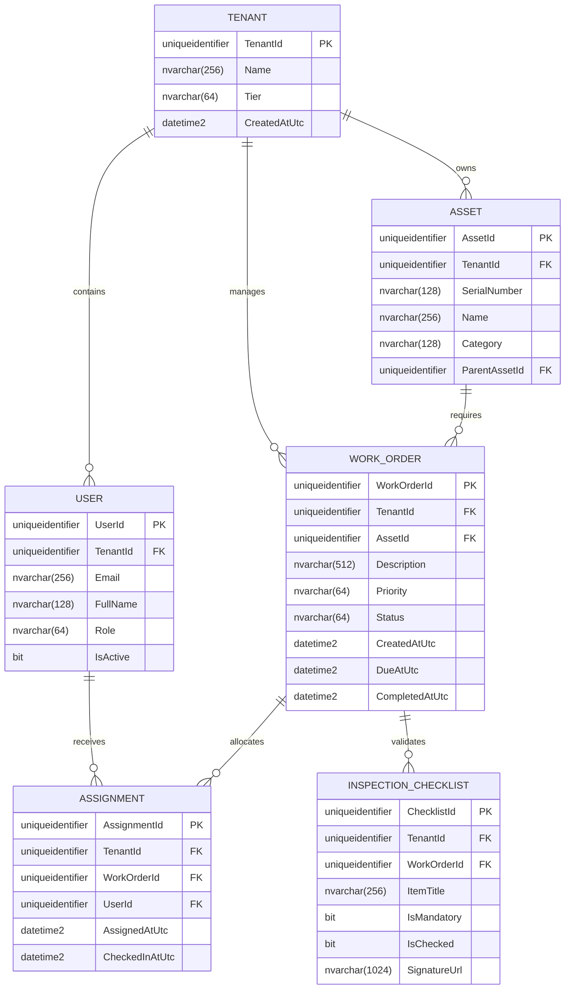

# DATABASE ENTITY-RELATIONSHIP DIAGRAM (ERD)

## Multi-Tenant Core Relational Schema

```mermaid
erDiagram
    TENANT ||--o{ USER : contains
    TENANT ||--o{ ASSET : owns
    TENANT ||--o{ WORK_ORDER : manages
    USER ||--o{ ASSIGNMENT : receives
    ASSET ||--o{ WORK_ORDER : requires
    WORK_ORDER ||--o{ ASSIGNMENT : allocates
    WORK_ORDER ||--o{ INSPECTION_CHECKLIST : validates
    
    TENANT {
        uniqueidentifier TenantId PK
        nvarchar(256) Name
        nvarchar(64) Tier
        datetime2 CreatedAtUtc
    }
    
    USER {
        uniqueidentifier UserId PK
        uniqueidentifier TenantId FK
        nvarchar(256) Email
        nvarchar(128) FullName
        nvarchar(64) Role
        bit IsActive
    }
    
    ASSET {
        uniqueidentifier AssetId PK
        uniqueidentifier TenantId FK
        nvarchar(128) SerialNumber
        nvarchar(256) Name
        nvarchar(128) Category
        uniqueidentifier ParentAssetId FK
    }
    
    WORK_ORDER {
        uniqueidentifier WorkOrderId PK
        uniqueidentifier TenantId FK
        uniqueidentifier AssetId FK
        nvarchar(512) Description
        nvarchar(64) Priority
        nvarchar(64) Status
        datetime2 CreatedAtUtc
        datetime2 DueAtUtc
        datetime2 CompletedAtUtc
    }
    
    ASSIGNMENT {
        uniqueidentifier AssignmentId PK
        uniqueidentifier TenantId FK
        uniqueidentifier WorkOrderId FK
        uniqueidentifier UserId FK
        datetime2 AssignedAtUtc
        datetime2 CheckedInAtUtc
    }
    
    INSPECTION_CHECKLIST {
        uniqueidentifier ChecklistId PK
        uniqueidentifier TenantId FK
        uniqueidentifier WorkOrderId FK
        nvarchar(256) ItemTitle
        bit IsMandatory
        bit IsChecked
        nvarchar(1024) SignatureUrl
    }
```
