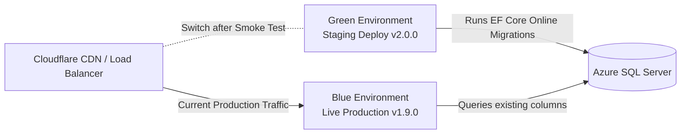

# PRODUCTION RELEASE & BLUE-GREEN DEPLOYMENT PROCESS

## Zero-Downtime Blue-Green Deployment Workflow

### Deployment Runbook Steps
1. Deploy new container image (`v2.0.0`) to the passive **Green Environment**.
2. Execute EF Core non-destructive `Expand` database migrations.
3. Run automated smoke tests against Green endpoints (`/health`, `/api/v1/work-orders`).
4. Swap routing slots in Cloudflare (`100% traffic to Green`).
5. Maintain passive Blue container for `24 hours` for instant rollback capability if anomalous error rates occur.
