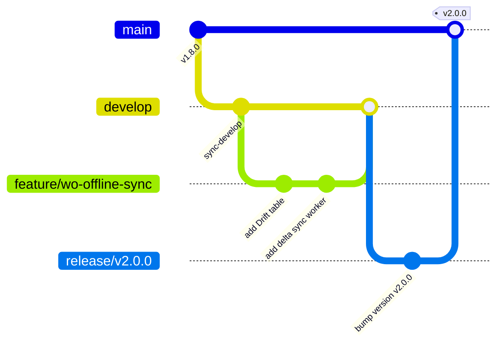

# BRANCHING STRATEGY & GIT FLOW (`Trunk-Based Development`)

## 1. Branch Topology

## 2. Branch Naming Rules
- **Feature Branches:** `feature/<ticket-id>-<short-description>` (e.g., `feature/FSP-104-offline-sync-queue`).
- **Bug Fixes:** `bugfix/<ticket-id>-<short-description>` (e.g., `bugfix/FSP-209-tenant-filter-leak`).
- **Hotfixes (Production):** `hotfix/vX.Y.Z-<short-description>` (e.g., `hotfix/v2.0.1-redis-timeout`).
