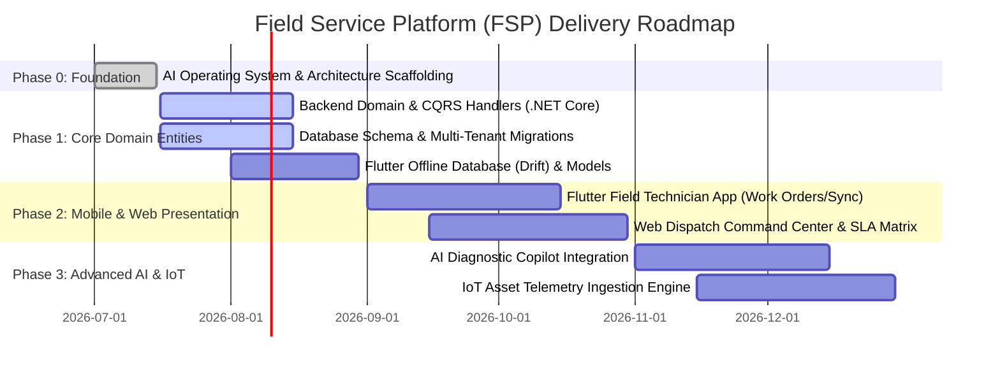

# PRODUCT ROADMAP & DELIVERY PHASES

## Roadmap Timeline

---

## Detailed Milestone Deliverables

### Phase 1: Core Domain Entities & Offline Storage (Q3 2026)
- Complete `FSP.Domain` pure entities: `Tenant`, `User`, `Asset`, `WorkOrder`, `Assignment`, `Inspection`.
- Complete MediatR `Commands` and `Queries` with `FluentValidation` in `FSP.Application`.
- Implement SQL Server multi-tenant database migrations (`FSP.Infrastructure`).
- Implement Flutter `Drift` local SQLite schema and sync queue client in `src/flutter/`.

### Phase 2: Field Mobile Client & Dispatch Portal (Q4 2026)
- Deliver high-performance Flutter mobile client with offline inspection checklists, signature capture, and photo upload sync.
- Deliver React/Web portal for dispatchers featuring live SLA monitoring and skill-based assignment.
- Conduct full E2E QA regression testing (`xUnit`, `Testcontainers`, `flutter_test`).
