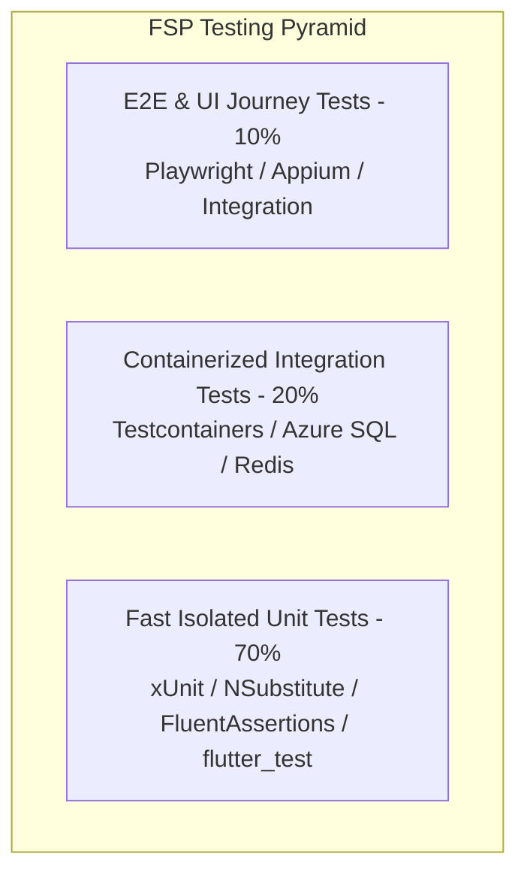

# MASTER TEST PLAN & QUALITY STRATEGY

## 1. Testing Pyramid & Target Coverage Metrics



### Coverage SLAs
- **`FSP.Domain` & `FSP.Application`:** Minimum `90%` line and branch coverage required before PR merge.
- **`src/flutter/lib/`:** Minimum `80%` widget and Riverpod state provider coverage.

---

## 2. Mandatory AAA Pattern (`Arrange-Act-Assert`)
Every unit test method across `.NET Core` and `Flutter` MUST be structured with explicit `AAA` comments:
```csharp
[Fact]
public async Task AssignTechnician_WhenWorkOrderIsDraft_ShouldTransitionToAssigned()
{
    // Arrange
    var workOrder = WorkOrder.Create(Guid.NewGuid(), Guid.NewGuid(), "HVAC Inspection", WorkOrderPriority.Normal);
    var technicianId = Guid.NewGuid();

    // Act
    var result = workOrder.AssignTechnician(technicianId);

    // Assert
    result.IsSuccess.Should().BeTrue();
    workOrder.Status.Should().Be(WorkOrderStatus.Assigned);
    workOrder.DomainEvents.Should().ContainSingle(e => e is WorkOrderAssignedDomainEvent);
}
```
